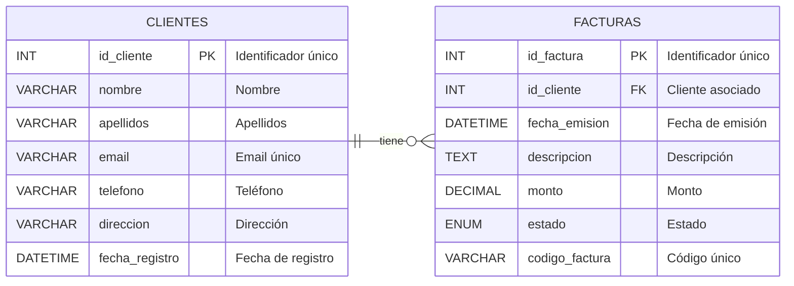

# CRM Gimnasio

Sistema profesional de gestión de clientes y facturación para gimnasios, desarrollado en Python y MySQL.

-----

## Tabla de Contenidos

- [Descripción](#descripción)
- [Características](#características)
- [Requisitos](#requisitos)
- [Instalación](#instalación)
- [Estructura del Proyecto](#estructura-del-proyecto)
- [Uso](#uso)
- [Modelo de Datos](#modelo-de-datos-diagrama-entidad---relacion)
- [Licencia](#licencia)

-----
## Descripción

Este CRM permite registrar, consultar, eliminar clientes y gestionar facturas asociadas, facilitando la administración de un gimnasio de manera eficiente y profesional.

-----
## Características

- Registro, búsqueda, listado y eliminación de clientes.
- Creación y visualización de facturas.
- Generación automática de códigos de factura únicos.
- Interfaz de usuario por consola.
- Persistencia de datos en MySQL.
- Resumen financiero por cliente.

-----

## Requisitos

- Python 3.8 o superior
- MySQL Server
- Paquetes: mysql-connector-python, python-dotenv

-----
## Instalación

1. Clona el repositorio:

```bash
git clone https://github.com/CescBlanco/cmr-gimnasio.git
```
2. (Opcional) Crea un entorno virtual:

```bash
python -m venv bbdd_venv
.\bbdd_venv\Scripts\activate
```

3. Instala las dependencias:
```bash
pip install -r requirements.txt
```
4. Configura la base de datos: 

    - Ejecuta el script crear_base_datos.sql en tu servidor MySQL.

5. Configura la conexión en .env:

    - Ajusta los parámetros de conexión (DB_HOST, DB_USER, DB_PASS, DB_NAME).
-----

## Estructura del proyecto

```plaintext
cmr-gimnasio/
    ├── bd.py                # Acceso y operaciones con la base de datos
    ├── crear_base_datos.sql # Script SQL para crear la base de datos y 
    ├── logica.py            # Lógica de negocio y validaciones
    ├── main.py              # Menú principal e interacción con el usuario
    ├── requirements.txt     # Dependencias del proyecto
    ├── .env                 # Variables de entorno (NO subido)
    |── README.md       
    └── .gitignore     
```

-----

## Uso

Ejecuta el programa principal

```bash
python main.py
```
Sigue las instrucciones del menú para gestionar clientes y facturas.

-----
## Modelo de datos: Diagrama Entidad - Relacion



-----
## Licencia 
Este proyecto se distribuye bajo la licencia MIT.

